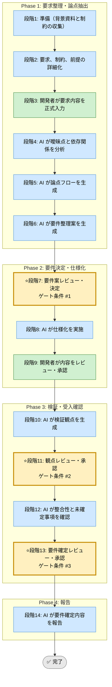

# 要件精緻化 Skill（統合フレームワーク）

## 利用する場面
- 要件が曖昧で実装着手の判断に迷う
- 受入条件を先に確定したい
- 非機能要件や制約を漏れなく整理したい
- スコープと非スコープを明確にしたい

## 対応の流れ（高レベル）

> 凡例: AI 担当 / 開発者 担当 / ゲート条件（開発者承認必須）

## 実行モード（推奨: balance）
| モード | 特徴 | 用途 |
|--------|------|------|
| strict | 論点、依存、非機能要件まで広く詰める | 監査対象、複数部門案件 |
| speed | 必須受入条件とスコープ境界に絞る | 小規模案件、緊急改修 |
| balance | 実装判断に必要な論点を過不足なく詰める | 標準的な案件 |

## Phase（段階）の概要

### Phase 1: 要求整理・論点抽出（段階1-6）
- 段階3: 開発者が背景、スコープ、非スコープ、非機能要件、不明点を入力
- 段階4: AI が曖昧点、依存、矛盾、未確定事項を分析
- 段階5: AI が業務フローと論点フローを生成
- 段階6: AI が複数の要件整理案を提示

出力: 要件整理シート、論点一覧、依存関係、要件整理案  
ゲート条件: なし（段階7で開発者が決定）

### Phase 2: 要件決定・仕様化（段階7-9）
- 段階7: 開発者が要件案を決定
- 段階8: AI がユーザーストーリー、受入条件、非機能要件、制約を仕様化
- 段階9: 開発者が仕様化結果を承認

出力: 仕様メモ、受入条件一覧、スコープ境界、未対応事項  
ゲート条件: 実装判断に必要な要件が揃っていること

### Phase 3: 検証・受入確認（段階10-13）
- 段階10: AI が要件検証観点を生成
- 段階11: 開発者が観点を承認
- 段階12: AI が整合性、欠落、未確定事項を確認
- 段階13: 開発者が要件確定として承認

出力: 要件検証観点、整合性確認結果、未確定事項台帳  
ゲート条件: 要件間矛盾が管理され、受入条件が判定可能であること

### Phase 4: 報告（段階14）
- 段階14: AI が確定要件、前提、残課題を報告

出力: 最終レポート（Markdown）

## ゲート条件と承認フロー

### 段階7: 要件案決定ゲート
判定条件:
- 背景、スコープ、制約が整理されているか
- 複数の整理案または論点整理が比較可能か
- 受入条件の方向性が見えているか

承認者: 開発者  
承認後: 段階8へ進行可能

### 段階11: 観点承認ゲート
判定条件:
- 受入条件が機能要件と非機能要件をカバーしているか
- 判定可能な表現になっているか
- 未確定事項が別管理されているか

承認者: 開発者  
承認後: 段階12へ進行可能

### 段階13: 要件確定承認ゲート
判定条件:
- 矛盾、依存、前提が整理されているか
- スコープ外が明示されているか
- 実装着手に必要な判断材料が揃っているか

承認者: 開発者  
承認後: 段階14へ進行可能

## 運用ルール
- 要件を推測で確定しない
- 未確定事項は削除せず保留管理する
- 受入条件は判定可能な文にする
- 変更理由を記録に残す

## 完了条件

- 段階7、11、13のゲート条件をすべて満たす
- 全段階ログがテンプレート形式で `docs/skill-logs/` に記録されている
- 受入条件が判定可能な文で記述されている
- スコープと非スコープが明示されている
- 最終報告書が作成済みで、判定根拠が追跡可能

## 記録・証跡
- 各段階の内容を `docs/skill-logs/requirements_refinement_${DATE}.md` に append-only で記録する
- スコープ、非スコープ、制約、受入条件、承認者を明記する

## 入力リファレンス

- 正本: runbook.md
- Phase 1 サブタスク: sub-skills/phase1-refinement.md
- Phase 2 サブタスク: sub-skills/phase2-specification.md
- Phase 3 サブタスク: sub-skills/phase3-validation.md
- Phase 4 サブタスク: sub-skills/phase4-reporting.md
- 後続モデル設計: ../../020_design-and-implementation/040_data-model-design-unified/SKILL.md
- 記録テンプレート: assets/requirements-refinement-log-template.md
