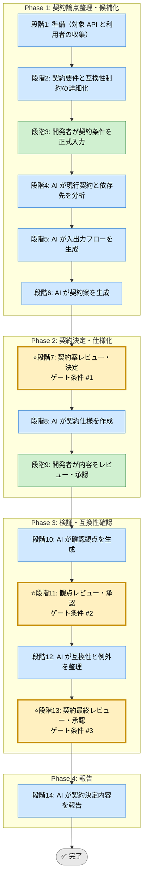

# API 契約設計 Skill（統合フレームワーク）

## このスキルが解く問題（教育）

<!-- AI実行対象外。3項目合計で最大200文字（1項目あたり約65文字を目安）。人間が読む学習コンテキスト -->

- API を実装後に変えると後方互換性が壊れ、クライアント全体に影響が連鎖する
- 入出力とエラーを先に固める。実装中の変更は利用者との「契約違反」になる
- API は「約束」。変えるコストが大きいため、設計段階に最大の思考を投資する

## 前提スキル / 次のステップ（教育）

<!-- AI実行対象外。最大5項目。密接な依存は個スキルレベルで、参考程度はカテゴリレベルでリンクする -->

- 前提: [010_requirements-refinement](../../010_requirements-and-planning/010_requirements-refinement/SKILL.md)（受入条件が確定している状態）
- 次: [050_feature-implementation-unified](../050_feature-implementation-unified/SKILL.md)（実装フェーズへ）

## 利用する場面
- API の入力、出力、エラー設計を明確にしたい
- 後方互換性を壊さずに変更したい
- クライアント、サーバー、外部連携の境界を整理したい
- 実装前に契約をレビュー可能な形で残したい

## 対応の流れ（高レベル）

## 実行モード（推奨: balance）
| モード | 特徴 | 用途 |
|--------|------|------|
| strict | 互換性、エラー設計、移行影響まで広く確認する | 公開 API、外部連携 API |
| speed | 必須の入出力と互換性に絞る | 内部 API、小規模変更 |
| balance | 契約変更の影響と実装現実性を両立する | 標準的な API 設計 |

## Phase（段階）の概要

### Phase 1: 契約論点整理・候補化（段階1-6）
- 段階3: 開発者が利用者、入出力、制約、互換性要件を入力
- 段階4: AI が現行契約、利用側依存、変更影響、データモデル対応を分析
- 段階5: AI が入出力、例外、バージョニングのフローを可視化
- 段階6: AI が複数の契約案を提示

出力: 契約論点一覧、現行差分、フロー図、契約案一覧  
ゲート条件: なし（段階7で開発者が決定）

### Phase 2: 契約決定・仕様化（段階7-9）
- 段階7: 開発者が契約案を決定
- 段階8: AI がリクエスト、レスポンス、エラー、互換性方針、データモデル対応表を仕様化
- 段階9: 開発者が仕様をレビューし承認

出力: API 契約書、変更方針、エラー表、互換性方針  
ゲート条件: 契約が利用者と互換性要件に整合すること

### Phase 3: 検証・互換性確認（段階10-13）
- 段階10: AI が確認観点を生成
- 段階11: 開発者が観点を承認
- 段階12: AI が互換性影響、移行手段、例外を整理
- 段階13: 開発者が最終契約を承認

出力: 確認観点、互換性影響一覧、移行メモ  
ゲート条件: 破壊的変更と対応策が管理されていること

### Phase 4: 報告（段階14）
- 段階14: AI が契約決定内容と残課題を報告

出力: 最終レポート（Markdown）

## ゲート条件と承認フロー

### 段階7: 契約案決定ゲート
判定条件:
- 利用者と利用文脈が整理されているか
- 複数の契約案が比較可能か
- 互換性要件が明確か

承認者: 開発者  
承認後: 段階8へ進行可能

### 段階11: 観点承認ゲート
判定条件:
- 正常系、異常系、境界、互換性の観点が含まれているか
- バージョニングや移行方法が考慮されているか
- ドキュメント更新対象が見えているか

承認者: 開発者  
承認後: 段階12へ進行可能

### 段階13: 契約最終承認ゲート
判定条件:
- 破壊的変更の扱いが定義されているか
- 利用者への影響が説明可能か
- 実装へ渡せる粒度になっているか

承認者: 開発者  
承認後: 段階14へ進行可能

## 完了条件

- 段階7、11、13のゲート条件をすべて満たす
- 全段階ログがテンプレート形式で `docs/skill-logs/` に記録されている
- API 契約書と互換性方針が承認されている
- 破壊的変更の扱いと利用者への影響が説明可能
- 最終報告書が作成済みで、判定根拠が追跡可能

## 記録・証跡
- 各段階の内容を `docs/skill-logs/api_contract_design_${DATE}.md` に append-only で記録する
- 利用者、契約案、互換性方針、承認者を明記する

## 実行前の自己確認（開発者向け）（教育）

<!-- AI実行対象外。Phase 1開始前に開発者が確認するチェックリスト。最大5項目 -->

- [ ] API の利用者（クライアント・サービス名）を具体的に挙げられる
- [ ] 後方互換性を壊す変更かどうかを判断できる
- [ ] エラーケースを3つ以上列挙できる

## 入力リファレンス
- 正本: runbook.md
- Phase 1 サブタスク: sub-skills/phase1-discovery.md
- Phase 2 サブタスク: sub-skills/phase2-contract-drafting.md
- Phase 3 サブタスク: sub-skills/phase3-compatibility-validation.md
- Phase 4 サブタスク: sub-skills/phase4-reporting.md
- モデル設計成果物: ../data-model-design-unified/SKILL.md
- ERD 作成ガイド: ../../shared-references/erd-best-practices.md
- データ辞書テンプレート: ../../shared-templates/data-dictionary-template.md
- 記録テンプレート: assets/api-contract-design-log-template.md
