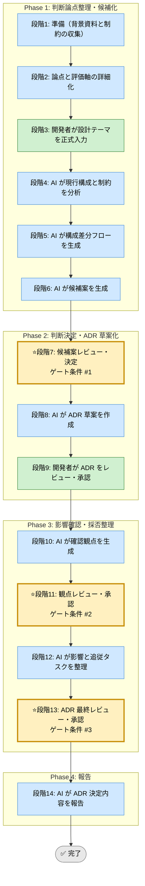

# ADR Skill（統合フレームワーク）

省略用語（RACI, KPI, ADR, DDL, SLO, QA, PM, TRK, EX）は [../../shared-references/glossary.md](../../shared-references/glossary.md) の『略語・日本語対応表』を参照してください。

## このスキルが解く問題（教育）

<!-- AI実行対象外。3項目合計で最大200文字（1項目あたり約65文字を目安）。人間が読む学習コンテキスト -->

- 設計判断の「理由」が記録されないと、後から「なぜそうなったか」誰もわからなくなる
- 候補案を決定前に並べる。決定後には「なぜ選ばなかったか」の記憶が消える
- ADR の価値は「何を決めたか」ではなく「なぜ他の案を選ばなかったか」を残すことにある

## 前提スキル / 次のステップ（教育）

<!-- AI実行対象外。最大5項目。密接な依存は個スキルレベルで、参考程度はカテゴリレベルでリンクする -->

- 前提: [010_requirements-refinement](../../010_requirements-and-planning/010_requirements-refinement/SKILL.md)（設計判断の背景となる要件が固まっている状態）
- 次: [050_feature-implementation-unified](../050_feature-implementation-unified/SKILL.md)（設計を実装に反映するとき）
- 次: [040_data-model-design-unified](../040_data-model-design-unified/SKILL.md)（データ設計の意思決定を記録するとき）

## 利用する場面
- 設計判断の理由を将来追跡できる形で残したい
- 複数案の比較を明確にしたい
- 実装前に設計の前提とトレードオフを共有したい
- 重要な技術判断をレビュー可能な形で残したい

## 対応の流れ（高レベル）

> 凡例: AI 担当 / 開発者 担当 / ゲート条件（開発者承認必須）

## 実行モード（推奨: balance）
| モード | 特徴 | 用途 |
|--------|------|------|
| strict | 候補案と将来影響を広く比較する | 基盤変更、長期運用に影響する判断 |
| speed | 重要論点と採否だけを素早く整理する | 小規模だが記録が必要な判断 |
| balance | 背景、比較、影響、追従タスクを過不足なく残す | 標準的な設計判断 |

## Phase（段階）の概要

### Phase 1: 判断論点整理・候補化（段階1-6）
- 段階3: 開発者が設計テーマ、制約、候補、判断期限を入力
- 段階4: AI が現行構成、技術制約、依存関係を分析
- 段階5: AI が構成差分フローを生成
- 段階6: AI が複数の候補案を提示

出力: 判断テーマ整理、比較軸、構成差分図、候補案一覧  
ゲート条件: なし（段階7で開発者が決定）

### Phase 2: 判断決定・ADR 草案化（段階7-9）
- 段階7: 開発者が候補案を決定
- 段階8: AI が ADR 草案を作成
- 段階9: 開発者が ADR 草案をレビューし承認

出力: ADR 草案、比較表、採否理由  
ゲート条件: 決定理由とトレードオフが説明可能であること

### Phase 3: 影響確認・採否整理（段階10-13）
- 段階10: AI が確認観点を生成
- 段階11: 開発者が観点を承認
- 段階12: AI が追従タスク、影響範囲、見直し条件を整理
- 段階13: 開発者が ADR 最終版を承認

出力: 影響範囲一覧、追従タスク、見直しトリガー  
ゲート条件: 影響と次アクションが管理できていること

### Phase 4: 報告（段階14）
- 段階14: AI が決定内容、理由、影響、次アクションを報告

出力: 最終レポート（Markdown）

## ゲート条件と承認フロー

### 段階7: 候補案決定ゲート
判定条件:
- 比較軸が明確か
- 複数案のメリットとデメリットが整理されているか
- 期限内に採用可能な案か

承認者: 開発者  
承認後: 段階8へ進行可能

### 段階11: 観点承認ゲート
判定条件:
- 影響先、移行、運用、保守の観点が含まれているか
- 採用しない案の理由が残るか
- 見直し条件が明記されているか

承認者: 開発者  
承認後: 段階12へ進行可能

### 段階13: ADR 最終承認ゲート
判定条件:
- ADR が第三者に理解可能な内容か
- 追従タスクと責任が見えるか
- 将来の見直しポイントが示されているか

承認者: 開発者  
承認後: 段階14へ進行可能

## 完了条件

- 段階7、11、13のゲート条件をすべて満たす
- 全段階ログがテンプレート形式で `docs/skill-logs/` に記録されている
- ADR が第三者に理解可能な内容で承認されている
- 追従タスクと将来の見直しポイントが示されている
- 最終報告書が作成済みで、判定根拠が追跡可能

## 記録・証跡
- 各段階の内容を `docs/skill-logs/adr_${DATE}.md` に append-only で記録する
- 採用案、却下案、根拠、影響範囲、承認者を明記する

## 実行前の自己確認（開発者向け）（教育）

<!-- AI実行対象外。Phase 1開始前に開発者が確認するチェックリスト。最大5項目 -->

- [ ] この判断が将来変更・参照される可能性があると思える
- [ ] 候補案を2つ以上挙げられる
- [ ] 判断の前提条件（将来変わる可能性がある事柄）を言える

## 入力リファレンス
- 正本: runbook.md
- Phase 1 サブタスク: sub-skills/phase1-discovery.md
- Phase 2 サブタスク: sub-skills/phase2-adr-drafting.md
- Phase 3 サブタスク: sub-skills/phase3-impact-validation.md
- Phase 4 サブタスク: sub-skills/phase4-reporting.md
- 記録テンプレート: assets/architecture-decision-record-log-template.md
