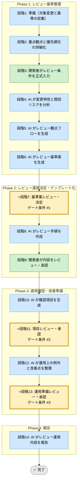

# コードレビュー支援 Skill（運用フレームワーク）

## このスキルが解く問題（教育）

<!-- AI実行対象外。3項目合計で最大200文字（1項目あたり約65文字を目安）。人間が読む学習コンテキスト -->

- レビュー基準がないと指摘がレビュワーの好みに依存し、品質のムラとチーム摩擦が生まれる
- 観点と差戻し基準を先に合意する。差し戻した後で基準を示すと関係が悪化する
- 「何を指摘するか」より「何を差し戻すか」を先に決めると基準が具体的になる

## 前提スキル / 次のステップ（教育）

<!-- AI実行対象外。最大5項目。密接な依存は個スキルレベルで、参考程度はカテゴリレベルでリンクする -->

- 前提: なし（実装フェーズの完了後に使う）
- セットで使う: [050_feature-implementation-unified](../050_feature-implementation-unified/SKILL.md)（機能実装後のレビューとして）
- セットで使う: [060_refactoring-safety](../060_refactoring-safety/SKILL.md)（リファクタリング後のレビューとして）

## 利用する場面
- レビュー観点を標準化したい
- 指摘の優先順位を揃えたい
- チーム内でレビュー品質を平準化したい
- 差戻し基準と受入基準を明確にしたい

## 対応の流れ（高レベル）

## 実行モード（推奨: balance）
| モード | 特徴 | 用途 |
|--------|------|------|
| strict | セキュリティ、性能、テスト性まで広く観点化する | 重要 PR、複雑変更 |
| speed | 最小限の差戻し基準に絞る | 小規模 PR |
| balance | 重大指摘を逃さず、レビュー負荷を抑える | 標準的なコードレビュー |

## Phase（段階）の概要

### Phase 1: レビュー基準整理（段階1-6）
- 段階3: 開発者がレビュー対象、重点観点、既知リスク、チームの差戻し基準を入力
- 段階4: AI が変更特性と既知リスクを分析
- 段階5: AI がレビュー観点フローを生成
- 段階6: AI がレビュー基準案を生成

出力: 変更分析、観点フロー、レビュー基準案  
ゲート条件: なし（段階7で開発者が決定）

### Phase 2: レビュー運用決定・テンプレート化（段階7-9）
- 段階7: 開発者がレビュー基準案を決定
- 段階8: AI がレビュー手順（テンプレート・観点一覧・指摘分類）を作成
- 段階9: 開発者が内容をレビュー・承認

出力: レビュー手順書、観点一覧、指摘分類基準  
ゲート条件: 重点観点と差戻し基準が合意されていること

### Phase 3: 適用確認・改善準備（段階10-13）
- 段階10: AI が適用確認項目を生成
- 段階11: 開発者が確認項目を承認
- 段階12: AI が運用例外と改善ポイントを整理
- 段階13: 開発者が運用準備を承認

出力: 確認項目一覧、例外方針、改善候補リスト  
ゲート条件: 実運用に適用可能な状態になっていること

### Phase 4: 報告（段階14）
- 段階14: AI がレビュー運用内容と改善ポイントを報告

出力: 最終レポート（Markdown）

## ゲート条件と承認フロー
### 段階7: 基準案決定ゲート
判定条件:
- 重点観点が対象変更に合っているか
- 差戻し基準が明確か
- 優先順位が共有可能か

承認者: 開発者  
承認後: 段階8へ進行可能

### 段階11: 項目承認ゲート
判定条件:
- レビュー観点が実務で使える粒度か
- 指摘分類が分かりやすいか
- 例外の扱いが決まっているか

承認者: 開発者  
承認後: 段階12へ進行可能

### 段階13: 運用準備承認ゲート
判定条件:
- テンプレートと基準が揃っているか
- フィードバックの取り方があるか
- 次回改善に繋がるか

承認者: 開発者  
承認後: 段階14へ進行可能

## 完了条件

- 段階7、11、13のゲート条件をすべて満たす
- 全段階ログがテンプレート形式で `docs/skill-logs/` に記録されている
- レビュー手順書と観点一覧が作成されている
- 差戻し基準と例外方針が明記されている
- 最終報告書が作成済みで、判定根拠が追跡可能

## 記録・証跡
- 各段階の内容を `docs/skill-logs/code_review_assistant_${DATE}.md` に append-only で記録する
- 重点観点、差戻し基準、例外、承認者を明記する

## 実行前の自己確認（開発者向け）（教育）

<!-- AI実行対象外。Phase 1開始前に開発者が確認するチェックリスト。最大5項目 -->

- [ ] このレビューで「必ず確認する観点」トップ3を挙げられる
- [ ] 「コメントする」と「差し戻す」の基準を区別できる
- [ ] チーム全員が同じ基準で判断できる粒度になっているか確認した

## 入力リファレンス
- 正本: runbook.md
- Phase 1 サブタスク: sub-skills/phase1-guideline-definition.md
- Phase 2 サブタスク: sub-skills/phase2-execution-planning.md
- Phase 3 サブタスク: sub-skills/phase3-feedback-and-adjustment.md
- Phase 4 サブタスク: sub-skills/phase4-continuous-improvement.md
- 記録テンプレート: assets/code-review-assistant-log-template.md
