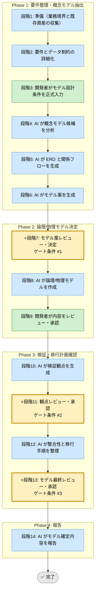

# データモデル設計 Skill（統合フレームワーク）

省略用語（RACI, KPI, ADR, DDL, SLO, QA, PM, TRK, EX）は [../../shared-references/glossary.md](../../shared-references/glossary.md) の『略語・日本語対応表』を参照してください。

## 利用する場面
- 要件からデータ構造を設計し、実装前に合意したい
- エンティティ、関係、制約を明確化したい
- ERD、データ辞書、DDL 方針を一貫した証跡として残したい
- API 契約や機能実装との整合を先に確認したい

## 対応の流れ（高レベル）

## 実行モード（推奨: balance）
| モード | 特徴 | 用途 |
|--------|------|------|
| strict | 正規化、整合性、移行計画まで広範に検証する | 監査対象、基幹データ、高リスク改修 |
| speed | 必須テーブルと主要関係に絞って設計する | 小規模機能、短納期案件 |
| balance | 重要制約を維持しつつ実装可能性を両立する | 標準的な機能開発 |

## Phase（段階）の概要

### Phase 1: 要件整理・概念モデル抽出（段階1-6）
- 段階3: 開発者が業務境界、エンティティ候補、制約、性能要件を入力
- 段階4: AI が概念モデル候補、関係、主要属性を分析
- 段階5: AI が ERD と関係フローを可視化
- 段階6: AI が複数のモデル案を提示

出力: 概念モデル一覧、ERD、主要制約、モデル案比較表  
ゲート条件: なし（段階7で開発者が決定）

### Phase 2: 論理/物理モデル決定（段階7-9）
- 段階7: 開発者がモデル案を決定
- 段階8: AI がテーブル定義、キー設計、インデックス方針、データ辞書を作成
- 段階9: 開発者が妥当性と実装性をレビューし承認

出力: 論理モデル、物理モデル、データ辞書、DDL 方針  
ゲート条件: 整合性制約と実装方針が説明可能であること

### Phase 3: 検証・移行計画確認（段階10-13）
- 段階10: AI が検証観点を生成
- 段階11: 開発者が観点を承認
- 段階12: AI が移行手順、互換性、例外を整理
- 段階13: 開発者が最終モデルを承認

出力: 検証観点、移行計画、互換性メモ  
ゲート条件: データ移行と運用影響が管理されていること

### Phase 4: 報告（段階14）
- 段階14: AI が確定モデル、残課題、実装引き継ぎ事項を報告

出力: 最終レポート（Markdown）

## ゲート条件と承認フロー

### 段階7: モデル案決定ゲート
判定条件:
- 要件とモデル境界が対応しているか
- 複数案の比較軸（正規化、性能、運用）が明確か
- ERD と制約が説明可能か

承認者: 開発者  
承認後: 段階8へ進行可能

### 段階11: 観点承認ゲート
判定条件:
- 整合性、性能、保守性の観点が含まれているか
- 移行時の影響範囲が見えているか
- API/実装への引き継ぎ観点が揃っているか

承認者: 開発者  
承認後: 段階12へ進行可能

### 段階13: モデル最終承認ゲート
判定条件:
- データ辞書と DDL 方針が矛盾なく揃っているか
- 例外・未確定事項が管理されているか
- 実装着手に必要な粒度になっているか

承認者: 開発者  
承認後: 段階14へ進行可能

## 完了条件

- 段階7、11、13のゲート条件をすべて満たす
- 全段階ログがテンプレート形式で `docs/skill-logs/` に記録されている
- データ辞書と DDL 方針が矛盾なく揃っている
- 移行計画と運用影響が管理されている
- 最終報告書が作成済みで、判定根拠が追跡可能

## 記録・証跡
- 各段階の内容を `docs/skill-logs/data_model_design_${DATE}.md` に append-only で記録する
- 要件ID、モデル案、制約、承認者、決定理由を明記する

## 入力リファレンス
- 正本: runbook.md
- Phase 1 サブタスク: sub-skills/phase1-discovery.md
- Phase 2 サブタスク: sub-skills/phase2-model-design.md
- Phase 3 サブタスク: sub-skills/phase3-validation.md
- Phase 4 サブタスク: sub-skills/phase4-reporting.md
- ERD 作成ガイド: ../../shared-references/erd-best-practices.md
- 調査チェックリスト: ../../shared-references/investigation-checklist.md
- データ辞書テンプレート: ../../shared-templates/data-dictionary-template.md
- 記録テンプレート: assets/model-design-log-template.md
