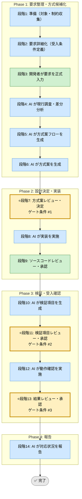

# 新規機能・機能変更対応Skill（統合フレームワーク）

省略用語（RACI, KPI, ADR, DDL, SLO, QA, PM, TRK, EX）は [../../shared-references/glossary.md](../../shared-references/glossary.md) の『略語・日本語対応表』を参照してください。


## 利用する場面
- C# / .NET アプリケーションで新規機能を追加したい
- 既存機能の仕様変更を、段階的に安全に進めたい
- 開発者承認ゲートを維持しながら、AI支援で調査・実装・検証を進めたい
- 要件からテストまでの証跡を追跡可能に残したい

## 対応の流れ（高レベル）



> **凡例**: 🔵 AI 担当  ／  🟢 開発者 担当  ／  🟡⭐️ ゲート条件（開発者承認必須）

## 実行モード（推奨: balance）
選択基準（共通）: [../../shared-references/execution-mode-guide.md](../../shared-references/execution-mode-guide.md)

| モード | 特徴 | 用途 |
|--------|------|------|
| strict | 証跡最大化。要求妥当性・影響分析を広範に実施 | クリティカル機能、監査対象改修 |
| speed | 証跡は最小必須。承認ゲートは維持 | 小規模機能変更 |
| balance | 承認ゲートと品質を維持し、証跡は最小必須+判断根拠 | 標準的な機能対応 |

## Phase（段階）の概要

### Phase 1: 要求整理・方式候補化（段階1-6）
- 段階3: 開発者が要求を入力（title, 背景, スコープ, 非機能要件, 受入条件）
- 段階4: AI が現行実装と仕様差分を調査（コード、DB、運用制約、既存モデル成果物）
- 段階5: AI が方式候補ごとのフロー図を生成
- 段階6: AI が方式案を3案以上提示（メリット/デメリット付き）

出力: 要求整理シート、差分分析、フロー図、方式案一覧  
ゲート条件: なし（段階7で開発者が決定）

### Phase 2: 設計決定・実装（段階7-9）
- 段階7: 開発者が方式案をレビュー・決定（ゲート条件 #1）
- 段階8: AI が決定案に沿って実装
- 段階9: 開発者がコードレビュー・承認

出力: 変更ファイル一覧、差分サマリ、実装根拠  
ゲート条件: 実装が選定方式と受入条件を満たしていること

### Phase 3: 検証・受入確認（段階10-13）
- 段階10: AI が検証項目を生成（正常系、境界値、異常系、回帰）
- 段階11: 開発者が検証項目をレビュー・承認（ゲート条件 #2）
- 段階12: AI が検証実施（必要時ダミー実装を明示）
- 段階13: 開発者が結果をレビュー・承認（ゲート条件 #3）

出力: 検証項目一覧、結果レポート、未達対応方針  
ゲート条件: 受入条件と品質基準を満たすこと

### Phase 4: 報告（段階14）
- 段階14: AI が最終報告（改修要約、テスト結果、品質判定、lessons learned）

出力: 最終レポート（Markdown）

## ゲート条件と承認フロー

### 段階7: 方式案決定ゲート（Phase 2 開始前）
判定条件:
- 要求整理、差分分析、方式案が十分な品質で提示されているか
- 複数案が比較可能か
- 受入条件を満たす見込みが明確か

承認者: 開発者  
承認後: 段階8へ進行可能

### 段階11: 検証項目承認ゲート（Phase 3 開始前）
判定条件:
- 検証項目が改修点と受入条件を網羅しているか
- テスト方法が実現可能か
- ダミー実装対象が明示されているか

承認者: 開発者  
承認後: 段階12へ進行可能

### 段階13: 受入結果承認ゲート（Phase 4 開始前）
判定条件:
- 全検証項目の結果が記録されているか
- 不合格項目の対処が明示されているか
- ビルド・静的チェック・回帰確認が完了しているか

承認者: 開発者  
承認後: 段階14へ進行可能

## 運用ルール

### 1. ステップ実行の原則
- 段階冒頭で実施内容を短く提示し、開発者確認を取る
- 1段階ずつ実行し、並行実行しない
- 各段階完了時に次段階進行可否を確認する

### 2. 承認ステータス
- 未承認: 開発者の判断待ち
- 承認済: 開発者が判断済み
- すべての決定に承認ステータスを記録する

### 3. 記録・証跡
- 各段階の作業内容と決定事項を `docs/skill-logs/feature_implementation_${DATE}.md` に append-only で記録
- TRK または EX で関連事項を紐付ける
- 日時、段階、決定者、判定根拠を明示する

### 4. 対象外・非対象
- 改修の決定権は開発者のみ
- AIは提案・実装支援を行うが、要件変更の最終判断は開発者が行う
- 実行ログの既存記録は削除・上書きしない

### 5. 参照優先順位（競合時）
```
実装ファイル（csproj/DDL/ログ等） ＞ runbook.md ＞ SKILL.md ＞ 実行ログ
```
- SKILL.md と runbook が不一致なら runbook を正とする
- 実行ログは履歴媒体であり、手順の正本として扱わない

## 入力リファレンス
- 正本（詳細手順・判定基準）: runbook.md
- Phase 1 サブタスク: sub-skills/phase1-discovery.md
- Phase 2 サブタスク: sub-skills/phase2-design-implementation.md
- Phase 3 サブタスク: sub-skills/phase3-validation.md
- Phase 4 サブタスク: sub-skills/phase4-reporting.md
- モデル設計成果物: ../data-model-design-unified/SKILL.md
- 調査チェックリスト: ../../shared-references/investigation-checklist.md
- テストケーステンプレート: ../../shared-references/testcase-template.md
- フロー図作成ガイド: ../../shared-references/flowchart-best-practices.md
- ERD 作成ガイド: ../../shared-references/erd-best-practices.md
- データ辞書テンプレート: ../../shared-templates/data-dictionary-template.md
- 記録テンプレート: assets/implementation-log-template.md

## 開始クイックパス

### 初回利用時
1. 本 SKILL.md のフロー、Phase、ゲート条件を確認
2. 要求内容を記述（段階3）
3. runbook の段階4（現行調査・差分分析）から開始

### 2回目以降の利用
1. 要求内容を記述
2. runbook の該当段階から開始
3. 判定が分かれる場合は runbook の判定基準を優先

## 使い分け（既存Skillとの境界）
- defect-repair-unified: 不具合原因の特定と修正が主目的
- feature-implementation-unified: 新規要求または仕様変更の実現が主目的

## 完了条件
- 段階7、11、13のゲート条件をすべて満たす
- 全段階ログがテンプレート形式で docs/skill-logs 配下に記録されている
- 検証で不合格項目がない、または承認済み例外として記録されている
- 最終報告書が作成済みで、判定根拠が追跡可能

---

バージョン: 1.0  
作成日: 2026-03-27  
最終更新: 2026-03-27
