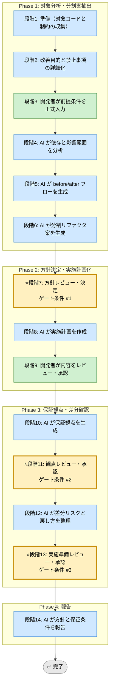

# リファクタリング安全化 Skill（統合フレームワーク）

## このスキルが解く問題（教育）

<!-- AI実行対象外。3項目合計で最大200文字（1項目あたり約65文字を目安）。人間が読む学習コンテキスト -->

- リファクタリングで既存の振る舞いを誤って変えると、デグレが検知されないまま本番に届く
- テストで外部仕様を固めてから内部を変える。逆順だと何を壊したか分からない
- 「振る舞いを変えない」という制約を先に宣言することが、安全なリファクタリングの唯一の手段

## 前提スキル / 次のステップ（教育）

<!-- AI実行対象外。最大5項目。密接な依存は個スキルレベルで、参考程度はカテゴリレベルでリンクする -->

- 前提: [030_test-strategy-unified](../../030_verification-and-quality/030_test-strategy-unified/SKILL.md)（テストがない場合は先に整備する）
- 次: [030_code-review-assistant](../030_code-review-assistant/SKILL.md)（変更後のレビュー）

## 利用する場面
- 振る舞いを変えずに内部構造を改善したい
- 影響範囲を明確にして安全に段階実施したい
- テストや差分観点を先に整理したい
- 大きな変更を小さく分割したい

## 対応の流れ（高レベル）

## 実行モード（推奨: balance）
| モード | 特徴 | 用途 |
|--------|------|------|
| strict | 依存、差分、回帰保証を広く確認する | 大規模リファクタリング |
| speed | 小さい単位に切って最小保証で進める | 軽微な内部改善 |
| balance | 変更単位と保証手段を両立する | 標準的な内部改善 |

## Phase（段階）の概要
### Phase 1: 対象分析・分割案抽出（段階1-6）
- 段階3: 開発者が改善目的、禁止事項、既存保証を入力
- 段階4: AI が依存、呼び出し元、影響範囲を分析
- 段階5: AI が before/after の構造フローを可視化
- 段階6: AI が複数の分割リファクタ案を提示

### Phase 2: 方針決定・実施計画化（段階7-9）
- 段階7: 開発者が方針を決定
- 段階8: AI が変更順、分割単位、確認方法を計画化
- 段階9: 開発者が計画を承認

### Phase 3: 保証観点・差分確認（段階10-13）
- 段階10: AI が保証観点を生成
- 段階11: 開発者が観点を承認
- 段階12: AI が差分リスク、戻し方、確認手順を整理
- 段階13: 開発者が実施準備を承認

### Phase 4: 報告（段階14）
- 段階14: AI が方針、保証条件、注意点を報告

## ゲート条件と承認フロー

### 段階7: 方針決定ゲート
判定条件:
- 改善目的と禁止事項が明確か
- 分割案が比較可能か
- 既存保証と追加保証が整理されているか

承認者: 開発者  
承認後: 段階8へ進行可能

### 段階11: 観点承認ゲート
判定条件:
- 回帰観点が主要経路をカバーするか
- 既存テストとの差分が見えるか
- 手動確認が必要な箇所が明確か

承認者: 開発者  
承認後: 段階12へ進行可能

### 段階13: 実施準備承認ゲート
判定条件:
- 変更順と戻し方が明確か
- 差分リスクが管理されているか
- 小さな単位で実施可能か

承認者: 開発者  
承認後: 段階14へ進行可能

## 完了条件

- 段階7、11、13のゲート条件をすべて満たす
- 全段階ログがテンプレート形式で `docs/skill-logs/` に記録されている
- 変更順と戻し方が明確で承認されている
- 差分リスクと保証手段が管理されている
- 最終報告書が作成済みで、判定根拠が追跡可能

## 記録・証跡
- 各段階の内容を `docs/skill-logs/refactoring_safety_${DATE}.md` に append-only で記録する
- 分割単位、保証手段、戻し方、承認者を明記する

## 実行前の自己確認（開発者向け）（教育）

<!-- AI実行対象外。Phase 1開始前に開発者が確認するチェックリスト。最大5項目 -->

- [ ] 「変えていい範囲」と「変えてはいけない外部仕様」を区別できる
- [ ] 変更前後で確認するテストが存在する（またはこれから作る）
- [ ] 段階的に分割して実施できる規模に分解できる

## 入力リファレンス
- 正本: runbook.md
- Phase 1 サブタスク: sub-skills/phase1-discovery.md
- Phase 2 サブタスク: sub-skills/phase2-execution-planning.md
- Phase 3 サブタスク: sub-skills/phase3-safety-validation.md
- Phase 4 サブタスク: sub-skills/phase4-reporting.md
- 記録テンプレート: assets/refactoring-safety-log-template.md
