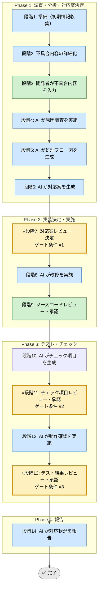

# 汎用不具合対応Skill（統合フレームワーク）

省略用語（RACI, KPI, ADR, DDL, SLO, QA, PM, TRK, EX）は [../../shared-references/glossary.md](../../shared-references/glossary.md) の『略語・日本語対応表』を参照してください。


## 利用する場面
- C# / .NET アプリケーションの機能不具合が発生し、原因から対応、テストまでを体系的に進めたい
- DB系・IPC系・パフォーマンス系・ビジネスロジック系など、あらゆる不具合カテゴリに対応したい
- 開発者主導で判断・承認を行いながら、AIが調査と実装を支援する協力モデルを採りたい
- 改修内容・テスト結果・対応状況を追跡可能な証跡として残したい

## 対応の流れ（高レベル）



> **凡例**: 🔵 AI 担当  ／  🟢 開発者 担当  ／  🟡⭐️ ゲート条件（開発者承認必須）

## 実行モード（推奨: balance）
選択基準（共通）: [../../shared-references/execution-mode-guide.md](../../shared-references/execution-mode-guide.md)

| モード | 特徴 | 用途 |
|--------|------|------|
| **strict** | 証跡最大化。探索・再探索を広範に、記録粒度を高い | クリティカルな不具合、監査対象改修 |
| **speed** | 証跡は最小必須セット。承認ゲートは維持 | 軽微な不具合、改修規模が小さい場合 |
| **balance** | 承認ゲート・品質を維持し、証跡は最小必須+判断根拠 | 標準的な不具合対応（推奨） |

## Phase（段階）の概要

### Phase 1: 調査・分析・対応案決定（段階3-6）
- **段階3**: 開発者が不具合内容を入力（title, 症状, 環境, 影響範囲）
- **段階4**: AI が原因調査（ログ解析、実装パターン確認、仕様確認）
- **段階5**: AI が処理フロー生成（Mermaid形式。不具合点⇔対応前後の差を示す）
- **段階6**: AI が対応案の生成（3案以上、各案のメリット/デメリット付き）

**出力**: 調査報告書、処理フロー図、複数の対応案  
**ゲート条件**: なし（段階7で開発者が決定）

### Phase 2: 実装決定・実施（段階7-9）
- **段階7**: 開発者が対応案をレビュー・決定 ⭐️ **ゲート条件 #1**
- **段階8**: AI が決定した対応案の改修を実施（ソースコード変更）
- **段階9**: 開発者がソースコードをレビュー・承認

**出力**: 変更ファイル一覧、差分サマリ、実装根拠  
**ゲート条件**: 実装が対応案と合致し、技術的に妥当なこと

### Phase 3: テスト・チェック（段階10-13）
- **段階10**: AI が動作確認のチェック項目を生成（改修点を網羅、品質優先）
- **段階11**: 開発者がチェック項目をレビュー・承認 ⭐️ **ゲート条件 #2**
- **段階12**: AI が動作確認を実施（必要時ダミー実装、決定事項は開発者に入力依頼）
- **段階13**: 開発者が実施結果をレビュー・承認 ⭐️ **ゲート条件 #3**

**出力**: チェック項目一覧、テスト結果レポート、ダミー実装実施内容  
**ゲート条件**: 改修点が十分にカバーされ、テスト結果が承認基準を満たすこと

### Phase 4: 報告（段階14）
- **段階14**: AI が対応状況をまとめて報告（変更要約、テスト結果、品質判定、lessons learned）

**出力**: 最終レポート（PDF/Markdown）  
**ゲート条件**: 全Phase完了済みで、承認状態が「承認済」

## ゲート条件と承認フロー

### 段階7: Phase 2 開始前のゲート（対応案決定）
**判定条件**:
- Phase 1 の出力（調査報告、フロー図、対応案）が十分な品質で提示されているか
- 複数案が検討対象になっているか
- 各案のメリット/デメリットが明確か

**承認者**: 開発者  
**承認後**: 段階8 へ進行可能

### 段階11: Phase 3 開始前のゲート（チェック項目承認）
**判定条件**:
- チェック項目が改修点を網羅しているか
- テスト方法が実現可能か
- ダミー実装が必要な場合、その対象が明示されているか

**承認者**: 開発者  
**承認後**: 段階12 へ進行可能

### 段階13: Phase 4 開始前のゲート（テスト結果承認）
**判定条件**:
- 全チェック項目について実施結果が記録されているか
- 不合格項目がある場合、対応状況が明示されているか
- ビルド、静的チェック、異常隠し防止チェックが完了しているか

**承認者**: 開発者  
**承認後**: 段階14（報告）へ進行可能

## 運用ルール

### 1. ステップ実行の原則
- **段階冒頭で計画提示**: 各段階冒頭で「この段階で何を実施するか」を短く提示し、開発者の確認を取る
- **1段階ずつ実行**: 複数段階を並行実行しない（確認・決定を確実にするため）
- **Next ステップ前の確認**: 段階完了ごとに「次段階へ進んでよいか」を明示的に確認する

### 2. 承認ステータス
- **未承認**: 開発者の判断・承認待ち状態
- **承認済**: 開発者が判断・承認を与えた状態
- ログファイルすべての決定に対して、承認ステータスを記録する

### 3. 記録・証跡
- 各段階の作業内容・決定事項を `docs/skill-logs/defect_repair_${CATEGORY}_${DATE}.md` に **append-only** で記録
- TRK (Tracking ID) または EX (Exception ID) で関連事項を関連付ける
- 日時・段階・決定者（開発者）・判定根拠を明示
- 段階完了時のサマリを記録テンプレートに従って記載

### 4. 対象外・非対象
- **改修の決定権**: 開発者のみ。AIが独断で方針を変更しない
- **テスト実施の権限**: AIが自動テストやダミー実装を提案するが、実現性確認は開発者と協議
- **文書修正**: 誤記を除き、既存記録の削除・上書きを行わない（history 保持）

### 5. 参照優先順位（競合時の優先度）
```
実装ファイル（csproj/DDL/ログ等） ＞ runbook.md ＞ SKILL.md ＞ 実行ログ
```
- SKILL.md とrunbook 記載が不一致の場合は **runbook を正とする**
- 実行ログは履歴媒体であり、手順の正本として扱わない
- 例外判定が必要な場合は、実装ファイルと runbook の両者で根拠を確認

## 入力リファレンス
- 正本（詳細手順・判定基準）: runbook.md
- Phase 1 サブタスク: sub-skills/phase1-investigation.md
- Phase 2 サブタスク: sub-skills/phase2-implementation.md
- Phase 3 サブタスク: sub-skills/phase3-testing.md
- Phase 4 サブタスク: sub-skills/phase4-reporting.md
- 検査チェックリスト: ../../shared-references/investigation-checklist.md
- テストケーステンプレート: ../../shared-references/testcase-template.md
- Mermaid 図作成ガイド: ../../shared-references/flowchart-best-practices.md
- 記録テンプレート: assets/defect-log-template.md

## 開始クイックパス

### 初回利用時
1. 本 SKILL.md の「対応の流れ」「Phase」「ゲート条件」を確認
2. 不具合内容を記述（段階3）
3. runbook.md の「段階4: 原因調査」を参照して AI が調査を開始

### 2回目以降の利用
1. 不具合内容を記述
2. runbook の該当段階から開始
3. 判定が分かれる場合は runbook の「判定基準」を確認

## 競合時ルール

| 場面 | 優先順位 | アクション |
|------|---------|----------|
| SKILL.md と runbook の記載が不一致 | runbook を正とする | runbook に従い、SKILL.md は更新予定 |
| 実装ファイル（DDL/csproj）との矛盾 | 実装ファイルを検証根拠とする | runbook で判定を明確化し、例外であれば EX 採番 |
| ログと手順書の齟齬 | 手順書（runbook）を正とする | ログは履歴かつ参考値。手順優先 |
| 開発者の判断と AI の提案が異なる | 開発者の判断を優先 | 決定とその根拠をログに記録 |

## 完了条件
- 段階7, 11, 13 のゲート条件をすべて満たしている
- 全段階の実行ログがテンプレート形式で `docs/skill-logs/` に記録されている
- テスト結果で不合格項目がない、または承認・例外記録済み
- 最終報告書が作成されている
- 決定・判定根拠がすべて追跡可能である

## 運用上の判断原則

### 調査段階での判断
- **原因が不明確な場合**は、仮説を複数立て、検証の優先順位を示す
- **影響範囲が大きい場合**は、最初に緊急対応か抜本対応かを分けて検討

### 対応案検討での判断
- **複数案の検討必須**: 最低3案を提示し、技術的・運用的観点を含める
- **クリティカルなロジック変更**は、既存テストのカバー率を先に確認

### テスト実施での判断
- **ダミー実装が必要な場合**は、その対象と実現方法を明示し、開発者に判断を依頼
- **テスト環境に依存する場合**は、テスト前提条件を明記

## 各Phase完了時の最小必須出力

### Phase 1 完了時
- ✅ 調査報告書（原因、検出ログ、該当ファイル／行番号）
- ✅ 処理フロー図（Mermaid形式）
- ✅ 複数の対応案（3案以上、メリット/デメリット付き）

### Phase 2 完了時
- ✅ 変更ファイル一覧（ファイルパス、変更内容概要）
- ✅ 差分サマリ（before / after のコード比較）
- ✅ 実装根拠（対応案とのマッピング）

### Phase 3 完了時
- ✅ チェック項目一覧（テスト ID、実施内容、期待結果）
- ✅ テスト結果レポート（合格/不合格、根拠）
- ✅ ダミー実装実施内容（該当項目、実装方法）

### Phase 4 完了時
- ✅ 最終レポート（改修要約、テスト結果サマリ、品質判定、lessons learned）

---

**バージョン**: 1.0  
**作成日**: 2026-03-27  
**最終更新**: 2026-03-27
