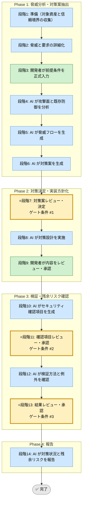

# セキュリティ強化 Skill（統合フレームワーク）

## 利用する場面
- 新規機能にセキュリティ観点を組み込みたい
- 認証、認可、入力検証、秘密情報管理の抜け漏れを防ぎたい
- 変更内容に対する脅威と対策を比較したい
- リリース前にセキュリティ残余リスクを明確にしたい

## 対応の流れ（高レベル）



> 凡例: AI 担当 / 開発者 担当 / ゲート条件（開発者承認必須）

## 実行モード（推奨: balance）
| モード | 特徴 | 用途 |
|--------|------|------|
| strict | 脅威モデル、対策、検証を広く扱う | 外部公開機能、個人情報、監査対象 |
| speed | 既存標準に沿って高優先脅威に絞る | 小規模変更、限定公開機能 |
| balance | 主要脅威と現実的な検証を両立する | 標準的な業務システム改修 |

## Phase（段階）の概要

### Phase 1: 脅威分析・対策案抽出（段階1-6）
- 段階3: 開発者が資産、利用者、外部接点、保護要件を入力
- 段階4: AI が攻撃面、既存対策、弱点を分析
- 段階5: AI が信頼境界と脅威フローを可視化
- 段階6: AI が複数の対策案を提示

出力: 資産一覧、脅威分析、脅威フロー、対策案一覧  
ゲート条件: なし（段階7で開発者が決定）

### Phase 2: 対策決定・実装方針化（段階7-9）
- 段階7: 開発者が対策案を決定
- 段階8: AI が入力検証、権限管理、監査ログ、秘密管理などの方針を整理
- 段階9: 開発者が実装方針をレビューし承認

出力: セキュリティ対策方針、適用範囲、例外方針  
ゲート条件: 対策が主要脅威を抑え、実装可能であること

### Phase 3: 検証・残余リスク確認（段階10-13）
- 段階10: AI がセキュリティ確認項目を生成
- 段階11: 開発者が確認項目を承認
- 段階12: AI が検証方法、例外、追加監視を整理
- 段階13: 開発者が残余リスクと受容判断を承認

出力: セキュリティチェックリスト、検証計画、残余リスク台帳  
ゲート条件: 検証観点と例外管理が明確であること

### Phase 4: 報告（段階14）
- 段階14: AI が対策結果、未解消リスク、監視事項を報告

出力: 最終レポート（Markdown）

## ゲート条件と承認フロー

### 段階7: 対策案決定ゲート
判定条件:
- 主要脅威が整理されているか
- 複数の対策案が比較可能か
- 採用案の残余リスクが説明可能か

承認者: 開発者  
承認後: 段階8へ進行可能

### 段階11: 確認項目承認ゲート
判定条件:
- 認証、認可、入力検証、秘密管理、監査が必要に応じて含まれているか
- 自動確認と手動確認の分担が明確か
- 例外扱いの項目に理由があるか

承認者: 開発者  
承認後: 段階12へ進行可能

### 段階13: 残余リスク承認ゲート
判定条件:
- 検証結果と未対応事項が記録されているか
- 受容するリスクに監視または緩和策があるか
- リリース判断に必要な情報が揃っているか

承認者: 開発者  
承認後: 段階14へ進行可能

## 運用ルール

### 1. ステップ実行の原則
- 脅威の想定根拠を毎段階で明示する
- 曖昧なリスク評価は High / Medium / Low の理由を付ける
- 承認前に対策案を独断で確定しない

### 2. 承認ステータス
- 未承認: 開発者判断待ち
- 承認済: 開発者判断済み
- 例外承認: 期限付きで受容

### 3. 記録・証跡
- 各段階の内容を `docs/skill-logs/security_hardening_${DATE}.md` に append-only で記録する
- 対策の対象資産、脅威、採用理由、例外理由を明記する
- 受容した残余リスクは期限と再確認条件を残す

### 4. 対象外・非対象
- 侵入テストや脆弱性診断の実施自体は本 Skill の範囲外
- セキュリティポリシーの最終承認は開発者または責任者が行う
- 秘密情報をログに残さない

### 5. 参照優先順位（競合時）
```
実装ファイル / セキュリティ標準 ＞ runbook.md ＞ SKILL.md ＞ 実行ログ
```

## 完了条件

- 段階7、11、13のゲート条件をすべて満たす
- 全段階ログがテンプレート形式で `docs/skill-logs/` に記録されている
- 残余リスクに監視または緩和策が付いている
- 秘密情報がログに含まれていない
- 最終報告書が作成済みで、判定根拠が追跡可能

## 入力リファレンス
- 正本: runbook.md
- Phase 1 サブタスク: sub-skills/phase1-threat-analysis.md
- Phase 2 サブタスク: sub-skills/phase2-control-design.md
- Phase 3 サブタスク: sub-skills/phase3-verification.md
- Phase 4 サブタスク: sub-skills/phase4-reporting.md
- 記録テンプレート: assets/security-hardening-log-template.md
