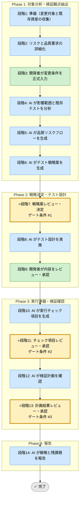

# テスト戦略統合 Skill（統合フレームワーク）

## 利用する場面
- 単体、結合、E2E のどこまで検証すべきか判断したい
- 改修の影響範囲に応じたテスト配分を決めたい
- テストケースの抜け漏れを抑えたい
- リリース前に検証方針を承認付きで固めたい

## 対応の流れ（高レベル）



> 凡例: AI 担当 / 開発者 担当 / ゲート条件（開発者承認必須）

## 実行モード（推奨: balance）
| モード | 特徴 | 用途 |
|--------|------|------|
| strict | 失敗モード、データ境界、回帰面を広く洗い出す | 大型改修、品質問題が顕在化している案件 |
| speed | 既存テスト資産を優先利用し、最小必須観点に絞る | 小規模修正、短納期案件 |
| balance | リスクベースで観点と層配分を決める | 標準的な改修案件 |

## Phase（段階）の概要

### Phase 1: 対象分析・検証観点抽出（段階1-6）
- 段階3: 開発者が変更内容、受入条件、既存テスト状況を入力
- 段階4: AI が影響範囲と既存テストのカバー状況を分析
- 段階5: AI が品質リスクと検証ポイントのフローを可視化
- 段階6: AI が単体、結合、E2E を含む複数のテスト戦略案を提示

出力: 影響分析、既存テスト棚卸し、リスクフロー、戦略案一覧  
ゲート条件: なし（段階7で開発者が決定）

### Phase 2: 戦略決定・テスト設計（段階7-9）
- 段階7: 開発者が戦略案をレビューし決定
- 段階8: AI がテスト層ごとの目的、実施順序、優先度、サンプルケースを設計
- 段階9: 開発者がテスト設計をレビューし承認

出力: テスト戦略書、テスト層別設計、優先順位表  
ゲート条件: 戦略が受入条件とリスクに整合していること

### Phase 3: 実行準備・検証確認（段階10-13）
- 段階10: AI が実行チェック項目を生成
- 段階11: 開発者が項目をレビューし承認
- 段階12: AI が前提条件、データ準備、環境依存、実行順を確認
- 段階13: 開発者が実行可能性と残余リスクを承認

出力: 実行チェックリスト、前提条件一覧、残余リスク一覧  
ゲート条件: 実行計画が現実的であり、抜け漏れが記録されていること

### Phase 4: 報告（段階14）
- 段階14: AI が採用戦略、実行順序、残課題を最終報告

出力: 最終レポート（Markdown）

## ゲート条件と承認フロー

### 段階7: 戦略案決定ゲート
判定条件:
- 変更影響と品質リスクが整理されているか
- 単体、結合、E2E の役割分担が比較可能か
- 採用案で受入条件を満たせる見込みが明確か

承認者: 開発者  
承認後: 段階8へ進行可能

### 段階11: 実行チェック項目承認ゲート
判定条件:
- チェック項目が改修点と主要リスクを網羅しているか
- テストデータ、環境、依存サービスの準備が明示されているか
- 手動確認が必要な箇所が識別されているか

承認者: 開発者  
承認後: 段階12へ進行可能

### 段階13: 実行準備完了承認ゲート
判定条件:
- 実施順序と優先度が妥当か
- 実行不可の項目と代替策が明示されているか
- リリース判断に必要な検証根拠が残るか

承認者: 開発者  
承認後: 段階14へ進行可能

## 運用ルール

### 1. ステップ実行の原則
- 段階冒頭で対象変更とゴールを再確認する
- 1段階ずつ進め、承認前に次段階へ進まない
- テスト観点の変更は理由を残して更新する

### 2. 承認ステータス
- 未承認: 開発者判断待ち
- 承認済: 開発者判断済み
- 差戻し: 前段階の再分析が必要

### 3. 記録・証跡
- 各段階の作業内容と決定事項を `docs/skill-logs/test_strategy_${DATE}.md` に append-only で記録する
- テスト層、対象機能、リスク、承認者を明記する
- 追加、削除した観点は理由を残す

### 4. 対象外・非対象
- テストの実装自体を自動で完了させることは本 Skill の対象外
- リリース可否の最終判断は開発者が行う
- 既存の実行結果を改ざんしない

### 5. 参照優先順位（競合時）
```
実装ファイル / 既存テスト資産 ＞ runbook.md ＞ SKILL.md ＞ 実行ログ
```

## 完了条件

- 段階7、11、13のゲート条件をすべて満たす
- 全段階ログがテンプレート形式で `docs/skill-logs/` に記録されている
- テスト戦略書と実行チェックリストが承認されている
- 実行不可の項目と代替策が明示されている
- 最終報告書が作成済みで、判定根拠が追跡可能

## 入力リファレンス
- 正本: runbook.md
- Phase 1 サブタスク: sub-skills/phase1-assessment.md
- Phase 2 サブタスク: sub-skills/phase2-test-design.md
- Phase 3 サブタスク: sub-skills/phase3-readiness.md
- Phase 4 サブタスク: sub-skills/phase4-reporting.md
- 記録テンプレート: assets/test-strategy-log-template.md
