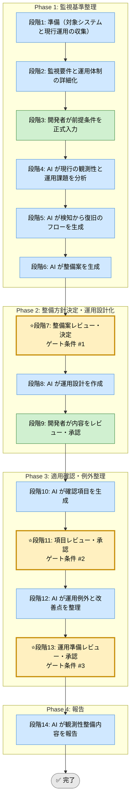

# 観測可能性・運用準備 Skill（運用フレームワーク）

省略用語（RACI, KPI, ADR, DDL, SLO, QA, PM, TRK, EX）は [../../shared-references/glossary.md](../../shared-references/glossary.md) の『略語・日本語対応表』を参照してください。

## 利用する場面
- 障害を早く検知できる状態にしたい
- ログ、メトリクス、アラートの不足を整理したい
- 初動対応手順を整えたい
- リリース後の運用受け渡しを強化したい

## 対応の流れ（高レベル）

## 実行モード（推奨: balance）
| モード | 特徴 | 用途 |
|--------|------|------|
| strict | 監視、初動、手順、SLO まで広く整える | 本番影響が大きいサービス |
| speed | 重要アラートと最小手順に絞る | 立ち上げ初期、限定運用 |
| balance | 検知、調査、初動の実運用性を両立する | 標準的な運用準備 |

## Phase（段階）の概要

### Phase 1: 監視基準整理（段階1-6）
- 段階3: 開発者が対象システム、監視したい事象、運用体制、既存ログ・メトリクスを入力
- 段階4: AI が現行の観測性と運用課題を分析
- 段階5: AI が検知から復旧のフローを生成
- 段階6: AI が整備案を生成

出力: 観測性現状評価、課題一覧、フロー図、整備案  
ゲート条件: なし（段階7で開発者が決定）

### Phase 2: 整備方針決定・運用設計化（段階7-9）
- 段階7: 開発者が整備案を決定
- 段階8: AI がログ設計、メトリクス定義、アラート条件、初動手順を作成
- 段階9: 開発者が内容をレビュー・承認

出力: 運用設計書、アラート条件一覧、初動手順  
ゲート条件: 検知・復旧の実運用性が説明可能であること

### Phase 3: 適用確認・例外整理（段階10-13）
- 段階10: AI が適用確認項目を生成
- 段階11: 開発者が確認項目を承認
- 段階12: AI が運用例外と改善ポイントを整理
- 段階13: 開発者が運用準備を承認

出力: 確認項目一覧、例外一覧、引き継ぎ資料  
ゲート条件: 初動対応が回る状態になっていること

### Phase 4: 報告（段階14）
- 段階14: AI が観測性整備内容と残課題を報告

出力: 最終レポート（Markdown）

## ゲート条件と承認フロー
### 段階7: 整備案決定ゲート
判定条件:
- 検知したい事象が整理されているか
- ログ、メトリクス、アラートの役割が分かれているか
- 運用体制に合うか

承認者: 開発者  
承認後: 段階8へ進行可能

### 段階11: 項目承認ゲート
判定条件:
- 監視項目と初動手順が対応しているか
- 運用例外が明確か
- 証跡の残し方があるか

承認者: 開発者  
承認後: 段階12へ進行可能

### 段階13: 運用準備承認ゲート
判定条件:
- 初動対応が回る状態か
- 未整備項目と期限が見えているか
- 引き継ぎ可能な内容か

承認者: 開発者  
承認後: 段階14へ進行可能

## 完了条件

- 段階7、11、13のゲート条件をすべて満たす
- 全段階ログがテンプレート形式で `docs/skill-logs/` に記録されている
- アラート条件と初動手順が整備されている
- 未整備項目と対応期限が管理されている
- 最終報告書が作成済みで引き継ぎ可能な状態である

## 記録・証跡
- 各段階の内容を `docs/skill-logs/observability_ops_${DATE}.md` に append-only で記録する
- 検知対象、アラート条件、初動手順、例外、承認者を明記する

## 入力リファレンス
- 正本: runbook.md
- Phase 1 サブタスク: sub-skills/phase1-guideline-definition.md
- Phase 2 サブタスク: sub-skills/phase2-execution-planning.md
- Phase 3 サブタスク: sub-skills/phase3-feedback-and-adjustment.md
- Phase 4 サブタスク: sub-skills/phase4-continuous-improvement.md
- 記録テンプレート: assets/observability-and-ops-readiness-log-template.md
