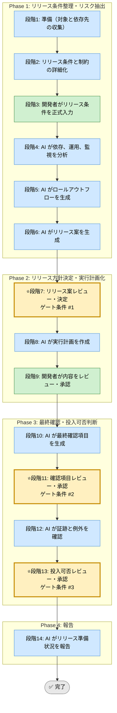

# リリース準備 Skill（統合フレームワーク）

## 利用する場面
- リリース前の確認漏れを防ぎたい
- ロールアウトとロールバックを事前に詰めたい
- 依存先や監視観点を整理したい
- 本番投入可否を根拠付きで判断したい

## 対応の流れ（高レベル）

> 凡例: AI 担当 / 開発者 担当 / ゲート条件（開発者承認必須）

## 実行モード（推奨: balance）
| モード | 特徴 | 用途 |
|--------|------|------|
| strict | 周辺影響、監視、ロールバック、周知まで広く確認する | 高リスク、本番影響大 |
| speed | 標準手順に乗る最小限の確認に絞る | 小規模リリース |
| balance | 本番投入判断に必要な確認を網羅する | 標準的な定期リリース |

## Phase（段階）の概要

### Phase 1: リリース条件整理・リスク抽出（段階1-6）
- 段階3: 開発者が対象、依存、投入日時、ロールバック条件、監視対象を入力
- 段階4: AI が依存先、運用条件、監視観点、変更影響を分析
- 段階5: AI がロールアウトとロールバックのフローを生成
- 段階6: AI が複数のリリース案を提示

出力: リリース条件整理、依存関係、投入フロー、リリース案一覧  
ゲート条件: なし（段階7で開発者が決定）

### Phase 2: リリース方針決定・実行計画化（段階7-9）
- 段階7: 開発者がリリース案を決定
- 段階8: AI が実施順、担当、確認ポイント、ロールバック、周知計画を作成
- 段階9: 開発者が計画をレビューし承認

出力: リリース計画書、ロールバック手順、周知事項  
ゲート条件: 実行可能で、失敗時の戻し方が明確なこと

### Phase 3: 最終確認・投入可否判断（段階10-13）
- 段階10: AI が最終確認項目を生成
- 段階11: 開発者が確認項目を承認
- 段階12: AI が証跡、未完了項目、例外を確認
- 段階13: 開発者が投入可否を承認

出力: 最終確認表、例外一覧、投入可否判断記録  
ゲート条件: 未完了項目と受容条件が管理されていること

### Phase 4: 報告（段階14）
- 段階14: AI が準備状況、例外、監視ポイントを報告

出力: 最終レポート（Markdown）

## ゲート条件と承認フロー

### 段階7: リリース案決定ゲート
判定条件:
- 依存先と影響範囲が把握できているか
- ロールアウト案とロールバック案が比較可能か
- リリース窓と体制に適合しているか

承認者: 開発者  
承認後: 段階8へ進行可能

### 段階11: 確認項目承認ゲート
判定条件:
- 技術、運用、周知、監視の項目が揃っているか
- 手順に抜け漏れがないか
- 例外項目の扱いが明確か

承認者: 開発者  
承認後: 段階12へ進行可能

### 段階13: 投入可否承認ゲート
判定条件:
- 重要証跡が揃っているか
- ロールバック条件が明確か
- 監視開始後の確認ポイントが定義されているか

承認者: 開発者  
承認後: 段階14へ進行可能

## 完了条件

- 段階7、11、13のゲート条件をすべて満たす
- 全段階ログがテンプレート形式で `docs/skill-logs/` に記録されている
- ロールバック条件と監視ポイントが定義されている
- 未完了項目と受容条件が管理されている
- 最終報告書が作成済みで、判定根拠が追跡可能

## 記録・証跡
- 各段階の内容を `docs/skill-logs/release_readiness_${DATE}.md` に append-only で記録する
- リリース対象、依存先、例外、承認者、ロールバック条件を明記する

## 入力リファレンス
- 正本: runbook.md
- Phase 1 サブタスク: sub-skills/phase1-discovery.md
- Phase 2 サブタスク: sub-skills/phase2-execution-planning.md
- Phase 3 サブタスク: sub-skills/phase3-go-live-validation.md
- Phase 4 サブタスク: sub-skills/phase4-reporting.md
- 記録テンプレート: assets/release-readiness-log-template.md
