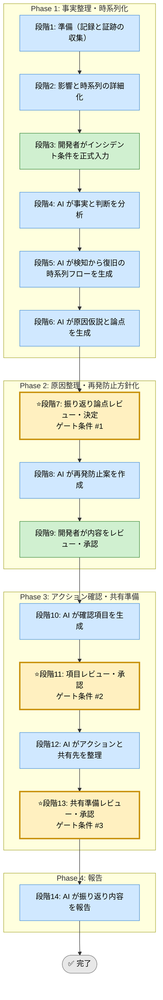

# インシデント振り返り Skill（運用フレームワーク）

## 利用する場面
- 障害や重大インシデントの再発防止策を整理したい
- 事実と推測を分けて原因を振り返りたい
- 初動対応、検知、判断の改善点を残したい
- 組織学習として横展開できる形にしたい

## 対応の流れ（高レベル）

## 実行モード（推奨: balance）
| モード | 特徴 | 用途 |
|--------|------|------|
| strict | 事実、判断、組織要因、再発防止を広く扱う | 重大障害、監査対象 |
| speed | 主要事実と即効性の高い対策に絞る | 軽微なインシデント |
| balance | 学習と運用改善に必要な粒度を確保する | 標準的な障害振り返り |

## Phase（段階）の概要

### Phase 1: 事実整理・時系列化（段階1-6）
- 段階3: 開発者がインシデント概要、影響範囲、時系列、証跡を入力
- 段階4: AI が事実と推測を分析・整理
- 段階5: AI が検知から復旧の時系列フローを生成
- 段階6: AI が原因仮説と論点を生成

出力: 事実整理、時系列フロー、原因仮説一覧  
ゲート条件: なし（段階7で開発者が決定）

### Phase 2: 原因整理・再発防止方針化（段階7-9）
- 段階7: 開発者が振り返り論点を決定
- 段階8: AI が再発防止案（検知強化、予防策、復旧改善）を作成
- 段階9: 開発者が内容をレビュー・承認

出力: 原因整理、再発防止案、アクション候補  
ゲート条件: 根本原因と対策の関係が説明可能であること

### Phase 3: アクション確認・共有準備（段階10-13）
- 段階10: AI が確認項目を生成
- 段階11: 開発者が確認項目を承認
- 段階12: AI がアクションと共有先を整理
- 段階13: 開発者が共有準備を承認

出力: 確認項目一覧、アクション一覧、共有資料案  
ゲート条件: アクションと教訓が横展開可能な形になっていること

### Phase 4: 報告（段階14）
- 段階14: AI が振り返り内容、アクション、教訓を報告

出力: 最終レポート（Markdown）

## ゲート条件と承認フロー
### 段階7: 振り返り論点決定ゲート
判定条件:
- 事実と推測が分かれているか
- 時系列と影響が整理されているか
- 原因仮説が比較可能か

承認者: 開発者  
承認後: 段階8へ進行可能

### 段階11: 項目承認ゲート
判定条件:
- 再発防止案が検知、予防、復旧の観点を含むか
- 担当と期限を付けられるか
- 共有対象が見えているか

承認者: 開発者  
承認後: 段階12へ進行可能

### 段階13: 共有準備承認ゲート
判定条件:
- 実行アクションが明確か
- 教訓が一般化されているか
- 機密情報の扱いが適切か

承認者: 開発者  
承認後: 段階14へ進行可能

## 完了条件

- 段階7、11、13のゲート条件をすべて満たす
- 全段階ログがテンプレート形式で `docs/skill-logs/` に記録されている
- アクション一覧に担当と期限が付いている
- 機密情報が適切に扱われている
- 最終報告書が組織学習として共有可能な形になっている

## 記録・証跡
- 各段階の内容を `docs/skill-logs/incident_postmortem_${DATE}.md` に append-only で記録する
- 時系列、影響、原因仮説、再発防止策、承認者を明記する

## 入力リファレンス
- 正本: runbook.md
- Phase 1 サブタスク: sub-skills/phase1-guideline-definition.md
- Phase 2 サブタスク: sub-skills/phase2-execution-planning.md
- Phase 3 サブタスク: sub-skills/phase3-feedback-and-adjustment.md
- Phase 4 サブタスク: sub-skills/phase4-continuous-improvement.md
- 記録テンプレート: assets/incident-postmortem-log-template.md
