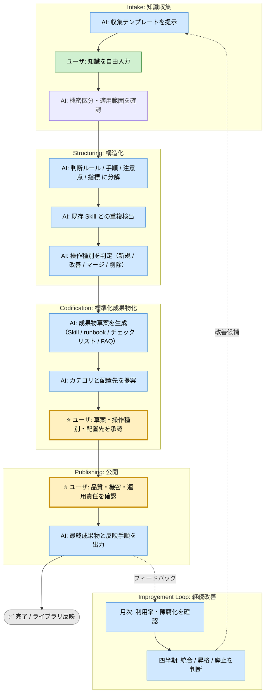

# Known-how Ingestion Skill

## 利用する場面

- チャットで話したノウハウをライブラリに残したい
- 暗黙知・判断基準・失敗パターンを形式化したい
- 既存 Skill の改善点に気づいた
- 複数の Skill を統合・整理したい
- 陳腐化した Skill を廃止・整理したい

## 実行モード（推奨: balance）
選択基準（共通）: [../../shared-references/execution-mode-guide.md](../../shared-references/execution-mode-guide.md)

| モード | 特徴 | 用途 |
|--------|------|------|
| strict | 証跡を最大化し、重複検出と影響判定を厳密に行う | 全社展開前の標準化、監査対象ナレッジ |
| speed | 最小必須の構造化と承認ポイントのみを実施する | 小規模なノウハウ追記、緊急共有 |
| balance | 追跡可能性と実務速度のバランスを取る | 通常のナレッジ取り込み |

## ワークフロー概要



## ステージの概要

### Intake: 知識収集
- AI が収集テンプレートを提示し、ユーザが自由に入力する
- 機密区分（公開可 / 限定公開 / 匿名化必須 / 記録不可）を確定する

### Structuring: 構造化
- 入力を「判断ルール / 手順 / 注意点 / 指標」に分解する
- 既存 Skill と重複・類似を検出する
- 操作種別（新規生成 / 既存改善 / Skill マージ / Skill 削除）を判定する

### Codification: 標準化成果物化
- Skill 草案 / runbook 草案 / チェックリスト草案 / FAQ 草案 を生成する
- カテゴリと `skills/` 配下の配置先を提案する
- **ユーザ承認ポイント①**: 草案・操作種別・配置先を確認する

### Publishing: 公開
- **ユーザ承認ポイント②**: 品質（再利用可能性、追跡可能性）・機密・運用責任を確認する
- 最終成果物と `skills/` への反映手順を出力する

### Improvement Loop: 継続改善
- 月次で利用率・陳腐化を確認する
- 四半期で統合・昇格・廃止を判定する

## 操作種別と判定基準

| 操作 | 判定条件 | 出力先 |
|---|---|---|
| 新規生成 | 類似 Skill がなく再利用価値がある | 新規 Skill フォルダ |
| 既存改善 | 既存 Skill と重なり品質向上できる | 該当 Skill.md / runbook |
| マージ | 複数 Skill が同一問題を扱っている | 統合後 Skill フォルダ |
| 削除 | 陳腐化・重複・90日未参照 | アーカイブまたは削除 |

## カテゴリ判定ルール

| 内容 | 配置先カテゴリ |
|---|---|
| 振り返り・学習・ノウハウ共有（既定） | `learning-and-improvement` |
| 要件・受入条件・優先度判断 | `requirements-and-planning` |
| 設計・実装・コードレビュー | `design-and-implementation` |
| テスト・品質・セキュリティ | `verification-and-quality` |
| 監視・性能・リリース | `operations-and-release` |

## 記録・証跡

- 実行ログは `docs/skill-logs/known_how_ingestion_${DATE}.md` に append-only で記録する
- 承認ポイントごとに日時・承認者・判断根拠を記録する
- 機密区分「記録不可」の内容はログに残さない

## 参照優先順位（競合時）

```
実装実体（成果物ファイル）＞ runbook ＞ SKILL.md ＞ 実行ログ
```

## 入力リファレンス

- 正本: [runbook.md](./runbook.md)
- Intake テンプレート: [sub-skills/intake-collection.md](./sub-skills/intake-collection.md)
- Structuring 手順: [sub-skills/structuring.md](./sub-skills/structuring.md)
- Codification 手順: [sub-skills/codification.md](./sub-skills/codification.md)
- Improvement Loop 手順: [sub-skills/improvement-loop.md](./sub-skills/improvement-loop.md)
- 実行ログテンプレート: [assets/known-how-ingestion-log-template.md](./assets/known-how-ingestion-log-template.md)
- 知識棚卸しテンプレート: [assets/known-how-inventory-template.md](./assets/known-how-inventory-template.md)

## 完了条件

- ユーザ承認ポイント①②を両方通過している
- 成果物草案が `skills/` への反映可能な形式で出力されている
- 機密区分が確定し、記録不可の情報がログに含まれていない
- 操作種別（新規 / 改善 / マージ / 削除）が明記されている

---

**バージョン**: 1.0
**作成日**: 2026-03-29
**最終更新**: 2026-03-29
