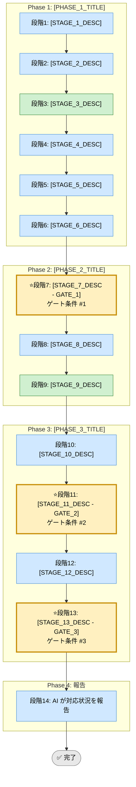

# [スキル日本語名]（統合フレームワーク）

## 共通ルールの参照先

- skills 配下で共通化する運用ルールの正本は [../copilot-instructions.md](../copilot-instructions.md)
- このファイルは SKILL.md のひな形であり、共通ルールそのものを定義する場所ではない
- リポジトリ最小ルールを確認したい場合のみ [../../../.github/copilot-instructions.md](../../../.github/copilot-instructions.md) を参照する

## このスキルが解く問題（教育）

<!-- AI実行対象外。3項目合計で最大200文字（1項目あたり約65文字を目安）。人間が読む学習コンテキスト -->

- [このスキルがなかったとき何が起きていたか（1行）]
- [なぜこのフローの順番で進めるのか（1行）]
- [このプロセスの背後にある設計原則（1行）]

## 前提スキル / 次のステップ（教育）

<!-- AI実行対象外。最大5項目。密接な依存は個スキルレベルで、参考程度はカテゴリレベルでリンクする -->

- 前提: [スキル名またはカテゴリ名]（あれば）
- 次: [スキル名またはカテゴリ名]

## 利用する場面

- [用途1（3-5項目を箇条書き）]
- [用途2]
- [用途3]
- [用途4]

## 対応の流れ（高レベル）



> **凡例**: 🔵 AI 担当  ／  🟢 開発者 担当  ／  🟡⭐️ ゲート条件（開発者承認必須）

**凡例説明**：
- 🔵 AI 担当 = AI が自動または支援で実行するステップ
- 🟢 開発者 担当 = 開発者による重要な入力・判定が必須なステップ
- 🟡⭐️ ゲート条件（開発者承認必須）= 進行判定ポイント

詳細は [glossary.md](../../shared-references/glossary.md) を参照してください。

## 実行モード（推奨: balance）

| モード | 特徴 | 用途 |
|--------|------|------|
| **strict** | [STRICT_MODE_DESC - 証跡最大化または詳細調査] | [STRICT_USE_CASE] |
| **speed** | [SPEED_MODE_DESC - 最小必須セット] | [SPEED_USE_CASE] |
| **balance** | [BALANCE_MODE_DESC - 標準的な運用] | [BALANCE_USE_CASE] |

## Phase（段階）の概要

### Phase 1: [PHASE_1_FULL_TITLE]（段階1-6）

[PHASE_1_OVERVIEW - 3-5個の段階について、実施内容・出力・ゲート条件を記述]

- **段階1**: [STAGE_1_DETAIL]
- **段階2**: [STAGE_2_DETAIL]
- **段階3**: [STAGE_3_DETAIL - 通常は開発者が重要な入力を行う]
- **段階4**: [STAGE_4_DETAIL - AI による分析・調査]
- **段階5**: [STAGE_5_DETAIL - AI による生成物（例: フロー図）]
- **段階6**: [STAGE_6_DETAIL - AI による複数案提示]

**出力**: [OUTPUT_LIST - 調査報告書、フロー図、複数案 等]  
**ゲート条件**: [GATE_CONDITION_1 - Phase 1 の出力が十分か等]

### Phase 2: [PHASE_2_FULL_TITLE]（段階7-9）

[PHASE_2_OVERVIEW]

- **段階7**: [開発者が意思決定] ⭐️ **ゲート条件 #1**
- **段階8**: [AI が実装・改修を実施]
- **段階9**: [開発者がレビュー・承認]

**出力**: [変更内容・差分サマリ、実装根拠]  
**ゲート条件**: [実装が決定内容に合致していること等]

### Phase 3: [PHASE_3_FULL_TITLE]（段階10-13）

[PHASE_3_OVERVIEW]

- **段階10**: [AI がチェック項目・テスト項目を生成]
- **段階11**: [開発者がレビュー・承認] ⭐️ **ゲート条件 #2**
- **段階12**: [AI が動作確認・検証を実施]
- **段階13**: [開発者が結果をレビュー・承認] ⭐️ **ゲート条件 #3**

**出力**: [チェック/テスト項目一覧、結果レポート]  
**ゲート条件**: [全項目カバー、テスト結果が基準を満たすこと等]

### Phase 4: 報告（段階14）

- **段階14**: AI が最終報告（改修요약、テスト結果、品質判定、lessons learned）

**出力**: 最終レポート（Markdown/PDF）  
**ゲート条件**: 全Phase完了済み、承認状態が「承認済」

## ゲート条件と承認フロー

### 段階7: Phase 2 開始前のゲート

**判定条件**:
- [GATE_1_CONDITION_A]
- [GATE_1_CONDITION_B]
- [GATE_1_CONDITION_C]

**承認者**: 開発者  
**承認後**: 段階8へ進行可能

### 段階11: Phase 3 開始前のゲート

**判定条件**:
- [GATE_2_CONDITION_A]
- [GATE_2_CONDITION_B]
- [GATE_2_CONDITION_C]

**承認者**: 開発者  
**承認後**: 段階12へ進行可能

### 段階13: Phase 4 開始前のゲート

**判定条件**:
- [GATE_3_CONDITION_A]
- [GATE_3_CONDITION_B]
- [GATE_3_CONDITION_C]

**承認者**: 開発者  
**承認後**: 段階14へ進行可能

## 運用ルール

### 1. ステップ実行の原則

- **段階冒頭で計画提示**: 各段階冒頭で「この段階で何を実施するか」を短く提示し、開発者の確認を取る
- **1段階ずつ実行**: 複数段階を並行実行しない（確認・決定を確実にするため）
- **Next ステップ前の確認**: 段階完了ごとに「次段階へ進んでよいか」を明示的に確認する

### 2. 承認ステータス

- **未承認**: 開発者の判断・承認待ち状態
- **承認済**: 開発者が判断・承認を与えた状態
- すべての決定に承認ステータスを記録する

### 3. 記録・証跡

- 各段階の作業内容・決定事項を `docs/skill-logs/[SKILL_CATEGORY]_${DATE}.md` に **append-only** で記録
- 日時・段階・決定者・判定根拠を明示
- 段階完了時のサマリを記録テンプレートに従って記載

### 4. 対象外・非対象

- **決定権**: 開発者のみ。AIが独断で方針を変更しない
- **文書修正**: 誤記を除き、既存記録の削除・上書きを行わない（history 保持）
- **共通ルール変更**: 保存先、命名、参照優先順位などの共通事項を変える場合は `skills/shared-templates/copilot-instructions.md` も更新対象に含める

### 5. 参照優先順位（競合時）

```
実装ファイル（csproj/DDL/ログ等） ＞ runbook.md ＞ SKILL.md ＞ 実行ログ
```

- SKILL.md と runbook が不一致なら runbook を正とする
- 実装ファイルが真実の源泉
- 実行ログは履歴媒体であり、手順の正本ではない

## 入力リファレンス

- **正本（詳細手順・判定基準）**: [runbook.md](./runbook.md)
- **Phase サブタスク雛形**: [sub-skills.md](./sub-skills.md)
- **チェックリスト（共通）**: ../../shared-references/investigation-checklist.md
- **テストケーステンプレート（共通）**: ../../shared-references/testcase-template.md
- **フロー図ガイド（共通）**: ../../shared-references/flowchart-best-practices.md
- **記録テンプレート（命名例）**: `assets/[SKILL_NAME]-log-template.md`

## 実行前の自己確認（開発者向け）（教育）

<!-- AI実行対象外。Phase 1開始前に開発者が確認するチェックリスト。最大5項目 -->

- [ ] [確認項目1]
- [ ] [確認項目2]
- [ ] [確認項目3]

## 開始クイックパス

### 初回利用時

1. 本 SKILL.md のフロー、Phase、ゲート条件を確認
2. [初期情報の形式] を記述（通常は段階3または段階1で実施）
3. runbook の関連段階から開始

### 2回目以降の利用

1. [初期情報の形式] を記述
2. runbook の該当段階から開始
3. 判定が分かれる場合は runbook の判定基準を優先

## 完了条件

- 段階7, 11, 13 のゲート条件をすべて満たしている
- 全段階の実行ログがテンプレート形式で `docs/skill-logs/` に記録されている
- 結果で不合格項目がない、または承認・例外記録済み
- 最終報告書が作成されている
- 決定・判定根拠がすべて追跡可能である

---

**バージョン**: 1.0  
**テンプレート作成日**: 2026-03-28  
**参照パターン**: feature-implementation-unified, defect-repair-unified
